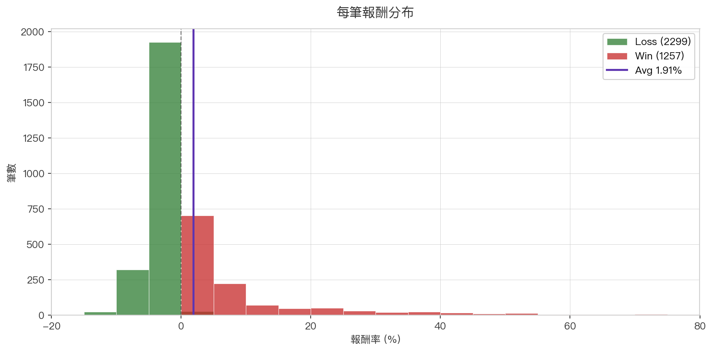
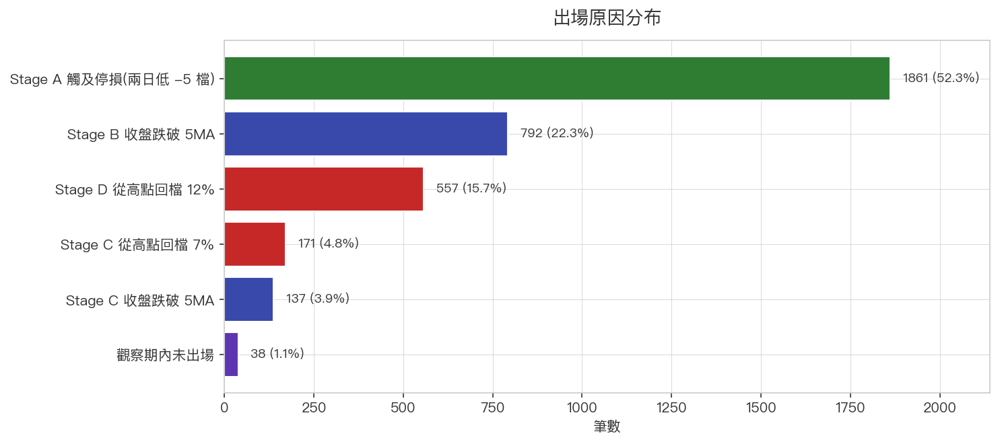
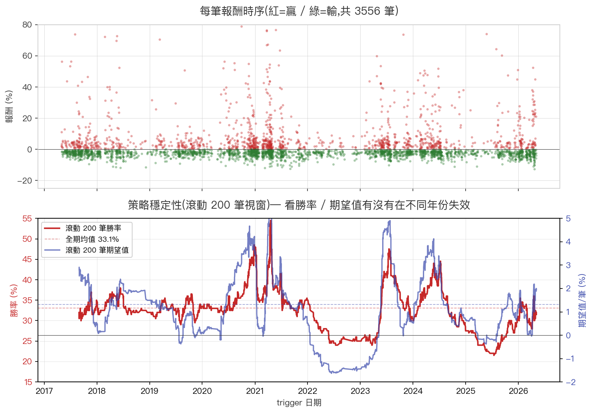
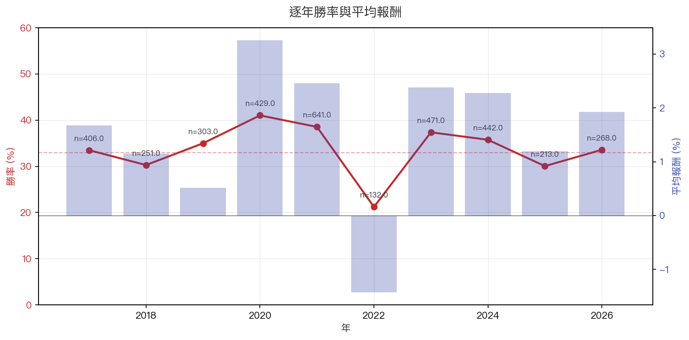
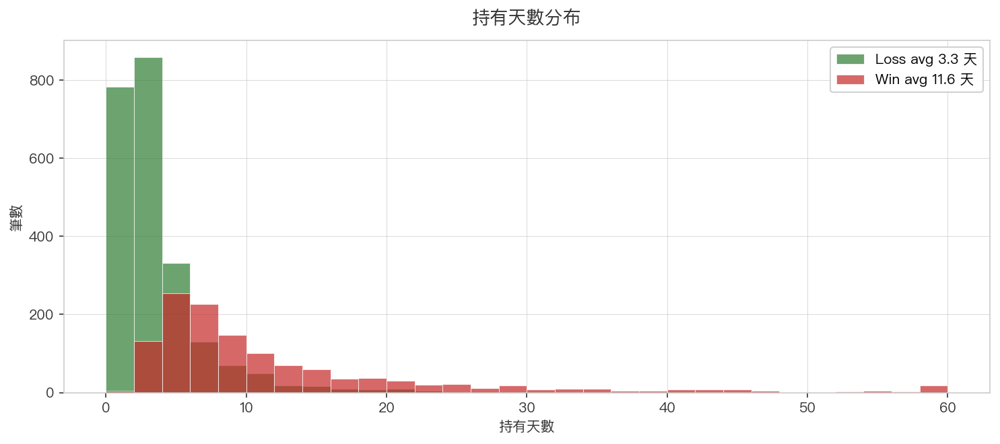
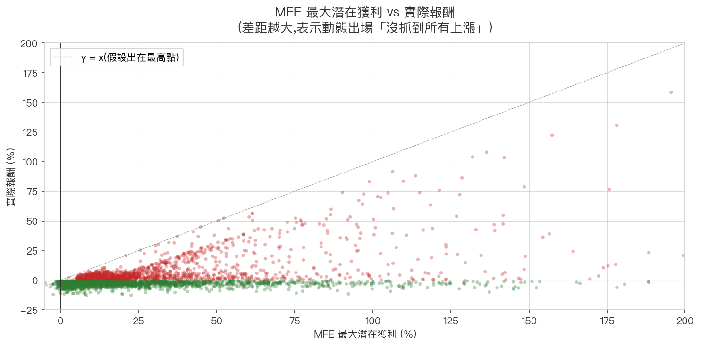

# 🎯 黑飛舞策略

**「黑飛舞」= 創高雙黑站5MA(強勢回檔)**

這是一個**台股短線「強勢股回檔買點」進場策略**,經過 **9 年全市場、3556 筆 trigger 完整回測驗證**。

> ⚡ **2026-05-07 更新**:加入「60MA > 120MA > 240MA macro alignment」進場條件 — 期望值從 +1.20% 提升到 **+1.91%**(+59%),勝率從 32.6% → **35.3%**。

---

## 進場條件(全部要符合)

| # | 條件 | 直白解釋 |
|---|------|---------|
| 1 | D-1 創 60 日新高 | 昨天創出近 3 個月新高 |
| 2 | D-1 收黑 | 昨天衝高被打回(疲弱訊號) |
| 3 | D 不創高(嚴格 D.High < D-1.High) | 今天沒突破昨天的高點 — 觸到平也不算過關 |
| 4 | D 收盤站上 5MA | 但短線結構未破壞 |
| 5 | 5MA > 10MA > 20MA > 60MA > 120MA | 短中期多頭排列 |
| **6** | **60MA > 120MA > 240MA** | **長期 macro alignment(年線之上),確保結構性多頭**(2026-05-07 新增)|

**流動性過濾**:近 20 日均量 ≥ 2000 張(避免小型股流動性陷阱)

---

## 為什麼這幾個條件加在一起有意義

- **創 60 日新高 + 收黑**:衝高被殺 = 短期賣壓出盡
- **D 不創高**:還沒有更多新買盤,空間清乾淨
- **站穩 5MA + 5MA 為最高均線**:**核心趨勢沒破** — 這只是「強勢股的健康回檔」,不是趨勢反轉

簡單說:**「強勢上漲股,衝高被打回後的低風險上車點」**

---

## 出場策略(四段式動態停利)

進場後依「進場後最高漲幅」(peak %) 分四階段:

| 階段 | 觸發條件 | 出場規則 |
|------|---------|---------|
| **Stage A** | peak < +5% | 收盤跌破停損價(兩日低 -5 檔) |
| **Stage B** | +5% ≤ peak < +10% | 收盤跌破 5MA → 出場 |
| **Stage C** | +10% ≤ peak < +15% | 跌破 5MA **或** 從高點回檔 7% → 出場 |
| **Stage D** | peak ≥ +15% | 從高點回檔 12% → 出場(不再看 5MA,讓飆股跑) |

### 設計邏輯

- **剛進場利潤薄** → 用緊停損保命(Stage A)
- **站穩 +5%** → 改用 5MA 移動停利,讓利潤奔跑(Stage B/C)
- **漲超過 +15%** → 忽略 5MA(因為 5MA 已遠),只看「**從高點回檔 12%**」鎖大利潤(Stage D)

---

## 📊 回測結果(9 年 / 全市場 / 3556 筆,含 macro alignment)

回測期間:**2017-05-02 ~ 2026-05-05**(含 2018 貿易戰 / 2020 疫情 / 2022 熊市 / 2024 AI 牛市)

### 核心指標

| 指標 | 數值 | 說明 |
|------|------|------|
| 總 trigger 數 | **3556** | 9 年全市場掃描(2052 檔)— macro alignment 過濾掉一半弱訊號 |
| 已結案 | 3518 | 觀察期內未出場僅 38 筆 (1.1%) |
| 勝率 | **35.3%** | wins=1257, losses=2299(較舊版 32.6% +2.7pp) |
| 平均獲利 | **+11.00%** | 含尾部飆股(最大 +162%) |
| 平均虧損 | **-3.05%** | Stage A 緊停損保命 |
| **每筆期望值** | **+1.91%** | 扣 0.4% 手續費後仍有 +1.51%(較舊版 +1.20% +59%) |
| 中位數報酬 | -1.65% | 多數單筆小虧,獲利集中在右尾 |
| 平均持有 | 6.3 天 | 短線策略 |
| 平均 MFE | +31.13% | 進場後潛在最高漲幅 |
| 平均 MAE | -14.18% | 「不停損」會看到的最大跌幅 — **證明停損很關鍵** |

### 每筆報酬分布

> **正偏態分布** — 多數筆數集中在 -5% ~ +5%,但右尾長(飆股 +50%+)。
> 這就是「**勝率不高但期望值為正**」的數學結構:用穩定小虧換一些大贏。

### 出場原因分布

> **52.3% 觸及 Stage A 停損** — 大多數 trigger 沒站穩 +5%,這是「短線回檔」的合理結果。
> **15.7% 走到 Stage D**(漲超過 +15% 後從高點回檔 12% 出場)— 是貢獻 +11.00% 平均獲利的核心來源。**macro alignment 加入後,Stage D 比例從 12.1% 提升到 15.7%**(過濾掉的弱訊號本來就難走到 Stage D)。

### 策略穩定性

> 上圖每個點是一筆 trigger(紅贏 / 綠輸)。下圖是滾動 200 筆視窗的勝率(紅線)與期望值(藍線)。
> **9.5 年期間勝率多數時候在 25%-40% 之間震盪**,期望值大部分時候 > 0,證明策略沒有明顯失效。

### 逐年表現

> ⚠️ **2022 是策略表現最差的年份**(勝率 ~20%、期望值 -1.2%) — 對應台股大空頭。
> 其餘年份勝率穩定在 28-36%,平均報酬 +0.5% ~ +2%。
> **熊市要降低部位甚至空手** — 多頭排列只是必要條件,大盤環境同樣關鍵。

### 持有天數分布

> 大部分輸單在 1-3 天內被停損(Stage A 觸發);贏單持有時間明顯較長,平均約 13 天,
> 對應「砍掉虧損、讓利潤奔跑」的設計意圖。

### MFE 最大潛在獲利 vs 實際報酬

> 散點圖顯示「實際報酬」總是遠低於「最大潛在獲利」,差距越大代表越多錢留在桌上。
> 但這是**移動停利策略的必然代價** — 想抓住最高點是不可能的,鎖利規則保住穩定獲利已是最佳解。

---

## 📌 現實使用注意事項

1. **回測 ≠ 實際操作**
   真實滑價、心理因素、執行紀律都會降低勝率。期望值 +1.91% 扣手續費(~0.4%/筆)後約 **+1.51%/筆**。

2. **熊市要空手或降部位**
   2022 熊市單年期望值轉負 — 多頭排列只是必要條件,大盤環境決定整體勝率。

3. **不適合大資金量**
   流動性過濾 ≥ 2000 張/日,但若單筆部位過大仍會吃到自己滑價。

4. **Forward Tracking 才是真正驗證**
   回測有 selection bias / lookahead bias 的可能,實際每天紀錄訊號 → 累積 30+ 筆已結案,
   再對照回測指標,才是策略可信度的真實檢驗。

---

## ✅ 適用範圍

| 適合 | 不適合 |
|------|--------|
| 中大型股(流動性 ≥ 2000 張/日) | 小型股(流動性差,滑價大) |
| 結構性多頭趨勢中的回檔 | 弱勢股 / 下跌趨勢中的反彈 |
| 短中線持有(平均 6.3 天) | 純當沖(本策略最少持有 1 天) |
| 中小資金 | 大資金量(會吃到自己) |

---

[👉 看實際黑飛舞掃描候選](../signals.md){ .md-button .md-button--primary }
[📊 看 DDMD 個股分析](../reports/index.md){ .md-button }
