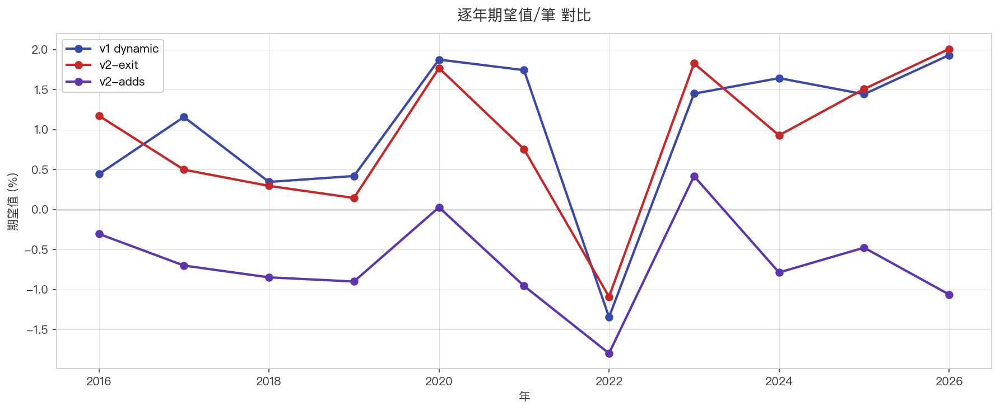

# 📊 黑飛舞策略版本戰績比較

跨版本回測對比,**同樣 7359 筆 trigger 樣本**(9.5 年全市場 / 2052 檔),只改出場+加碼邏輯。

---

## ⭐ 核心結論

| 版本 | 期望值/筆 | 對比 v1 | 結論 |
|---|---|---|---|
| **v1 dynamic**(現行) | **+1.20%** | — | 🥇 量化最佳 |
| v2-exit(簡化出場) | +0.95% | -21% | ⚠️ 反而較差 |
| v2-adds(簡化+加碼) | -0.59% | -149% | ❌ 期望值轉負 |

**結論:v1 是冠軍,v2 兩版皆敗**。詳見 [v2 策略說明](strategy_v2.md) 的失敗原因分析。

---

## 完整指標對比


| 指標 | v1 dynamic | v2-exit | v2-adds |
|---|---|---|---|
| 總 trigger | 7359 | 7359 | 7359 |
| 勝 | 2398 | 2095 | 1207 |
| 敗 | 4885 | 5125 | 6076 |
| 觀察期未結 | 76 | 105 | 63 |
| **勝率** | **32.6%** | **28.5%** | **16.4%** |
| **平均獲利** | **+9.48%** | **+9.29%** | **+9.09%** |
| **平均虧損** | **-2.81%** | **-2.38%** | **-2.50%** |
| **每筆期望值** | **+1.20%** | **+0.95%** | **-0.59%** |
| 平均持有 | 6.4 天 | 4.8 天 | 3.9 天 |
| 平均 MFE | +26.55% | +26.55% | +26.55% |
| 平均 MAE | -13.01% | -13.01% | -13.01% |

> 三版的 MFE / MAE 完全一致(因為 trigger 樣本相同,只是出場邏輯不同)— 可驗證對比公平。

---

## 📈 各版本報酬分布


> **三版分布形狀很像,但 v2 中位數略左移**(更多 -3% ~ -5% 小虧)。
> 右尾(大贏單 +30% 以上)v2 略少,因為早被「跌破 5MA」洗掉。

---

## 📅 逐年期望值對比



> 大部分年份 v1 > v2-exit > v2-adds。**僅 2022 熊市三版差不多差**(-1.5% 上下)— 那年所有策略都吃虧。

---

## 💰 累積簡單加總(策略整體獲利能力)


> 每筆 % 直接相加(非複利)看「策略整體吐多少 alpha」。
> v1 累積 ~9000% / v2-exit ~7000% / v2-adds ~-4000% — **v2-adds 跑 9 年實際是賠錢**。

---

## 🚪 各版本出場原因分布

### v1 dynamic
```
Stage A 觸及停損(兩日低-5檔)    4200  (57%)
Stage B 收盤跌破 5MA            1613  (22%)
Stage D 從高點回檔 12%           893  (12%)
Stage C 從高點回檔 7%            302  ( 4%)
Stage C 收盤跌破 5MA            275  ( 4%)
觀察期內未出場                  76  ( 1%)
```

### v2-exit
```
v2 早段(<10%)跌 5MA             6187  (84%) ← 被 5MA 洗單比例極高
v2 大段(>15%)回 16%              652  ( 9%)
v2 中段(10-15%)跌 5MA           397  ( 5%)
觀察期內未出場                  105  ( 1%)
v2 中段(10-15%)回 13%            18  ( 0%)
```

### v2-adds
```
v2-adds 早段 跌 5MA (加 0x)     3456  (47%)
v2-adds 早段 跌 5MA (加 1x)     1725  (23%) ← 加碼後立刻被洗
v2-adds 早段 跌 5MA (加 2x)     1453  (20%) ← 加滿後也被洗
v2-adds 大段 回 16% (加 2x)      370  ( 5%)
v2-adds 中段 跌 5MA (加 2x)      231  ( 3%)
觀察期內未出場 (加 2x)           63  ( 1%)
```

> **3178 筆「加碼後早段跌 5MA」**(=43%)— 等於把賺 +5% 的單變成 -2.5% 損失。加碼反而成了「**反向洗單機器**」。

---

## 🤔 解讀:為什麼 improvement.md 的「好直覺」回測會輸?

詳見 [v2 策略說明](strategy_v2.md) 的「為什麼 v2 反而差?」章節。

簡短版:**人類交易的優勢在「酌情判斷」**(挑強勢股、看大盤、看籌碼酌情加碼)。把這些判斷拿掉,只留「機械規則」, **寬規則 = 更多 noise 通過篩選 = 期望值降**。

---

## 🔭 後續實驗方向

如果要再試改革,可考慮:

| 方向 | 假設 |
|---|---|
| 加「大盤環境 filter」 | 空頭時不進場,可能讓 v2 在多頭年表現更好 |
| 加「trigger 強度評分」 | 只取最強 30% trigger,過濾無效訊號 |
| 加碼條件加嚴 | 改成 +5% 才能加(現在 > 0% 就可),減少加碼後立刻被洗 |
| 不加碼只改出場 | v2-exit 已測試 — 仍輸 v1 |
| **回到 v1 + 改進 trigger** | 從進場品質下手而非出場規則 |

---

[👈 看 v1 完整策略](strategy.md){ .md-button .md-button--primary }
[🔬 v2 詳細失敗分析](strategy_v2.md){ .md-button }
