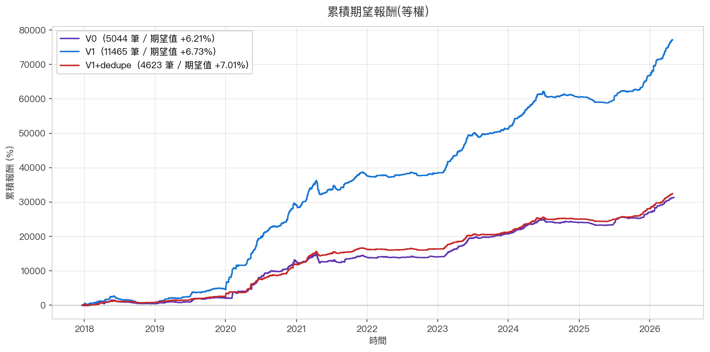
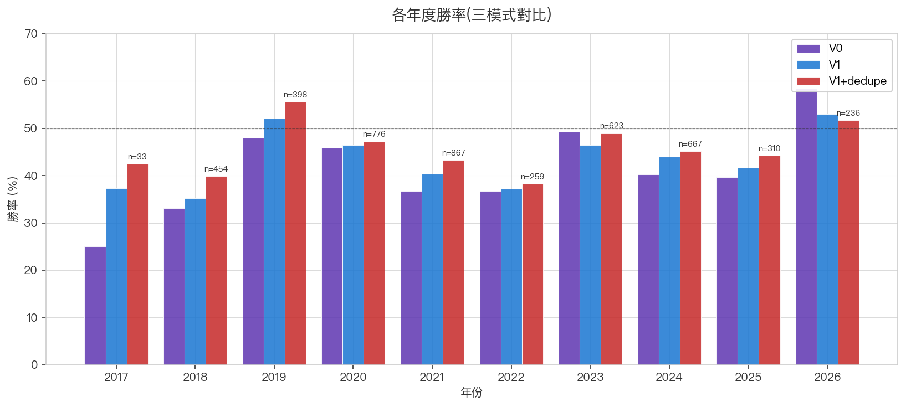

# 🚀 紅爆 V1(D1 直接進場)

> **狀態**:V1 backtest 驗證後,合併 dedupe 為現役版本。本頁說明 V1 的單獨設計與動機。

---

## 設計動機 — V0 的等待是一種懲罰

V0 為了過濾假突破,要求 D4 / D5 都站穩 D1 close 才進場。但 backtest 看到一個反直覺結果:

> 被 V0「D4/D5 驗證」剔除的 6421 筆 D1 候選,在 V1 直接進場框架下平均報酬 **+7.69%** —
> **比 V0 進場標的的 +6.10% 還高**。

代表 V0 的等待是「**反向選擇了較弱的訊號**」。

### 為何 V0 等待會反選

1. **D2-D5 是回檔噪音**:創高 + 量爆後股票回檔 1-2 天本來就常見,V0 把這些「健康回檔」當失敗訊號剔除
2. **V0 等到 D5 進場價已上漲**:錯失初動段,壓縮上漲空間
3. **20 天結算機制本來就容忍短期回檔**:不需要 D5 證明強度,結算機制自己會處理

---

## 進場條件

| Step | 條件 |
|------|------|
| 1 | D1 創 400 日新高 + 量 ≥ 20 日均量 3x |
| 2 | **D1 收盤(13:00 後)直接進場** |
| 3 | 例外:**若 D1 漲停(+9.95% 以上)→ D2 開盤進場** |

漲停判定:`(D1.close - prev.close) / prev.close >= 0.0995`(留 0.05% 緩衝避免精度問題)

漲停隔日進場的合理性:
- 漲停鎖死,當日無法買入
- 隔日開盤通常還有慣性(可能更高、可能跳水),但 backtest 顯示**整體仍正貢獻**

## 出場條件

跟 V0 相同 — 滾動 20 天結算 ≥ 5%(機械式)。

---

## 📊 9 年回測(V1 重複版,未 dedupe)

| 指標 | V0 | **V1** | 差距 |
|------|----|----|------|
| 樣本(進場數) | 5044 | **11465** | +6421(2.3x)|
| 勝率 | 42.7% | **43.6%** | +0.9pp |
| 平均獲利 | +26.80% | +26.04% | -0.76 |
| 平均虧損 | -9.36% | -9.20% | +0.16 |
| **每筆期望值** | **+6.10%** | **+6.95%** | **+0.85** |
| 中位數報酬 | -1.57% | -1.39% | +0.18 |
| 平均持有 | 30.0 天 | 30.4 天 | +0.36 |
| 最大贏單 | +1027% | +1075% | +48 |
| 最大輸單 | -45.2% | -54.3% | -9.1 |

V1 的進場分佈:**約 10500 筆 D1 close 進場 + 950 筆漲停隔日開盤進場**(漲停占比 8.3%)。

### 累積期望報酬

藍線(V1)整體斜率高於紫線(V0),且樣本曲線拉得更遠。

### 各年度勝率

V1 在 9 年中 **每一年勝率都 ≥ V0**,沒有市場 regime 退化。

---

## V1 的取捨

| 面向 | V0 | V1 |
|------|-----|-----|
| 進場時間 | D5 收盤(D1 後 4 個交易日) | D1 收盤(當天 13:00 後)|
| 操作節奏 | 較從容(觀察 4 天再決定) | 即時(13:00 後就要下單) |
| 漲停處理 | 不影響(等到 D5) | 需要前晚下 D2 開盤掛單 |
| 假突破風險 | 較低(D4/D5 已過濾)| 較高(全進)|
| 中位數虧損 | -1.57% | -1.39% |
| 最大單筆虧損 | -45% | -54% |

V1 的代價是:

1. **心理上更急** — 13:00 後要當機立斷下單,沒有 4 天觀察緩衝
2. **單筆下檔風險略大** — V0 經 D4/D5 過濾,V1 全進
3. **需要前晚掛單** — 漲停股要 D2 開盤進場,得前晚下單

但**期望值與總報酬都顯著更高**,backtest 9 年穩定。

---

## 還沒解決的問題:重複進場

V1 的 11465 筆中,實際上有大量「同檔多次觸發 D1」的重複部位 — 同一檔股在 30 天
持有期間若再次創新高量爆,V1 backtest 會視為新一筆 trade。

實戰一倉一筆,**這是樣本放大但失真**。下一階段做 [Dedupe](strategy_red_burst_dedupe.md)
解決。

回到 → [紅爆策略主頁](strategy_red_burst.md)
