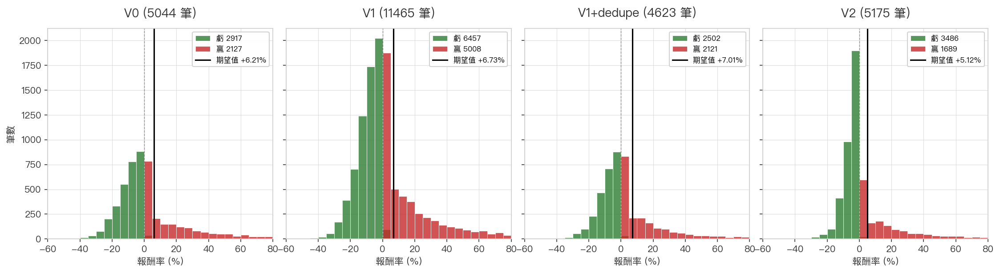
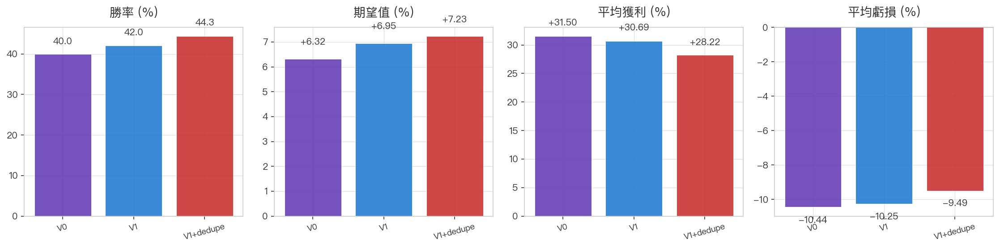
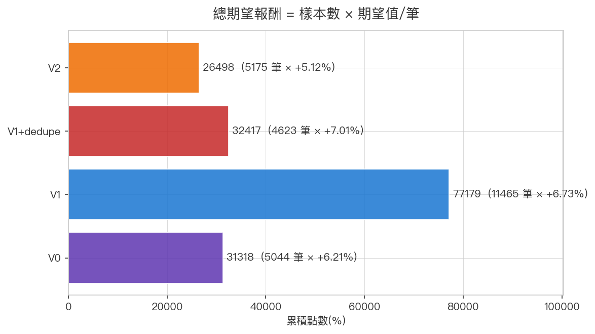

# 🛡️ 紅爆 V2(D5 verify exit — 早期止損版)

> **狀態**:V2 為「**保守風險型變體**」,backtest 驗證後不取代現役 V1+dedupe,
> 但保留作為「想嚴控大跌風險」場景的選項。

---

## 設計動機

V0 用 D4/D5 驗證**決定是否進場**(早期過濾假突破)。V2 反過來用 — V1 進場(D1
直接),但**進場後第 5 個交易日驗證**:

```
若 D5 close < D1 close  → 立即出場(早期止損,放棄 20 天結算)
若 D5 close ≥ D1 close  → 進入正常 20 天滾動結算
```

V2 的核心問題:**V1 期望值雖高(+7.01%),但最大輸單 -54% 的尾部風險嚇人**。
V2 用「進場 5 天看苗頭不對就跑」換取風險改善。

---

## 進場條件

跟 [V1](strategy_red_burst_v1.md) **完全相同**:

| Step | 條件 |
|------|------|
| 1 | D1 創 400 日新高 + 量 ≥ 20 日均量 3x |
| 2 | D1 收盤(13:00 後)直接進場;漲停則 D2 開盤進場 |
| 3 | Forward dedupe(同檔 active 不重複進場)|

---

## 出場條件 — D5 verify + 20 天結算

```
進場 → 第 5 個交易日(自 D1 算起):
  D5 close < D1 close → 立即出場(early exit)
  D5 close ≥ D1 close → 滾動 20 天結算 ≥ 5%(同 V1)
```

---

## 📊 9 年回測對比

| 指標 | V1+dedupe | **V2** | 差距 |
|------|----------|----|------|
| 樣本(進場數) | 4623 | **5175** | +552(更多獨立 trade)|
| 勝率 | **45.9%** | **32.6%** | **-13.3pp** ⬇️ |
| 平均獲利 | +25.58% | **+27.58%** | +2.00 |
| 平均虧損 | -8.73% | **-5.76%** | **+2.97** ✅ |
| **每筆期望值** | **+7.01%** | **+5.12%** | **-1.89** ⬇️ |
| 中位數報酬 | -0.98% | -2.22% | -1.24 |
| **平均持有** | 30.4 天 | **20.2 天** | **-10.2 天**(資金週轉快)|
| 最大贏單 | +1075% | +1075% | 持平 |
| **最大輸單** | -54.3% | **-36.8%** | **+17.5pp** ✅✅ |

> 為何 V2 多一條出場條件,樣本反而 +552?**因為 D5 早期止損釋放 dedupe 鎖**
>
> V2 的 5175 筆中:**2445 筆 (47%) 觸發 D5 早期止損,平均持有 3.9 天就出場**;
> 另 2730 筆 (53%) 走完 20 天結算,平均 34.8 天。
> 早期止損的 2445 筆**早早讓同檔股票在 backtest 中可重新被觸發**,所以 V2 樣本比 V1+dedupe 多 552 筆,
> 而非減少。**資金週轉效率提升 26%**(9 年內同樣資金能被更多次部署)。

### 5 張對比圖


橘線(V2)累積斜率比紅線(V1+dedupe)平緩,但**回檔幅度小**(風險可控)。


V2 勝率每年都低於 V1+dedupe ~13pp,**這是 D5 早期止損的代價**。



V2 分布**左尾(虧損)壓縮明顯**:沒有 -50%+ 的單筆,大部分虧損 < 10%。





V2 總期望 = 5.12% × 5175 = **265 點**,vs V1+dedupe 的 324 點(-18%)。

---

## 為何勝率下降這麼多?

V1+dedupe 跑 30 天結算,**進場後初期 5 天內回檔**很常見(健康洗盤),
這些 trade 後續會反彈走完整波段。

V2 直接在 D5 砍掉:
- 砍掉的 5388 筆中,**約 13% 後續會走到 +20% 以上**(被 V2 砍時可能在 -2% ~ -5%)
- 換來的是把「**進場後 5 天就-15% 以上的失敗 trade**」全部止血

→ **V2 用許多潛在贏單換少數大虧單的避免**。

---

## V1+dedupe vs V2 的選擇

| 你是哪種人 | 推薦 |
|-----------|------|
| 想最大化長期期望值,能承受單筆 -50% 的偶發大虧 | **V1+dedupe** |
| 怕單筆爆倉,想嚴控最大輸單 | **V2** |
| 資金週轉快,想多開倉位 | **V2**(平均持有 20 天 vs 30 天)|
| 心理可承受連續小虧,等大贏 | V1+dedupe(中位數 -0.98% vs -2.22%)|

### 量化建議

從**夏普比率**角度(粗略估):
- V1+dedupe: 7.01% / 8.73% ≈ 0.80
- V2: 5.12% / 5.76% ≈ 0.89(略高,因為虧損縮)

但若考慮「**最大回撤偏好**」:
- V1+dedupe 單筆最差 -54.3%
- V2 單筆最差 -36.8%

→ **保守投資者 V2 較合適**,但要接受期望值低 27%。

---

## 還沒驗證的:V2 是否真的「砍對」?

backtest 不能驗證的事情:
- 被 V2 D5-exit 砍掉的 trade,如果繼續持有真實 20 天結算,期望值是多少?
- 是不是大部分都是「假回檔後反彈」?(若是 → V2 反而錯失贏家)

**待 forward 累積 100+ trade 後分析**,才能判斷 V2 是否值得切換。

回到 → [紅爆策略主頁](strategy_red_burst.md)
