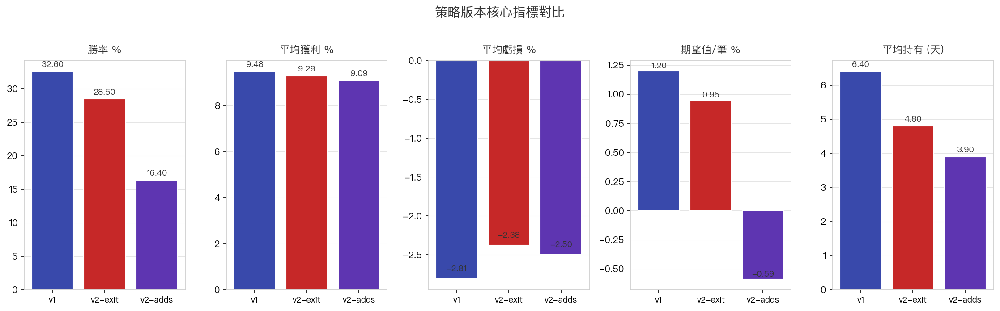
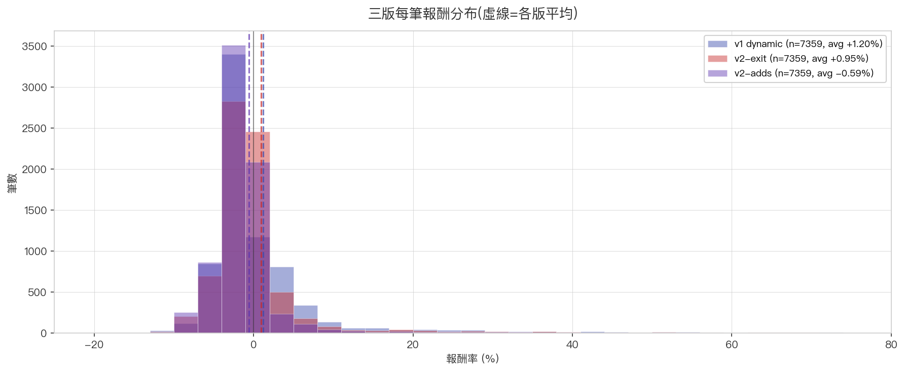
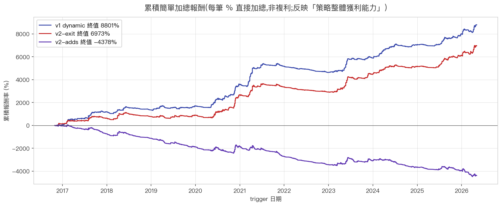

# 🔬 黑飛舞 v2 — 簡化出場 + 加碼策略

> **這頁記錄一次「好直覺被回測打臉」的實驗。** 我們嘗試把出場規則簡化、加上「賺錢加碼」邏輯,結果反而比 v1 差。
> 完整對比數字見 [v1 vs v2 戰績比較](strategy_compare.md)。

---

## 為什麼要做 v2?

v1 dynamic 出場策略雖然回測穩定(33% 勝率、+1.20% 期望值),但對「執行」有 3 個痛點:

1. **規則複雜**:四段式停利規則對人類即時判斷負擔大
2. **緊停損頻繁觸發**:Stage A「兩日低 -5 檔」(~ -3-5%)很容易在盤中波動就被掃出場
3. **沒有加碼機制**:賺錢的單最多賺 +12-16%(Stage D 規則),沒辦法「讓利潤奔跑」放大

`improvement.md` 是個人交易筆記,提出兩個簡化方向:

- **簡化出場**:三段(早段跌 5MA / 中段回 10-15% / 大段回 12-20%),拿掉緊停損
- **動態加碼**:賺錢的單突破前高 → 倍增部位

直覺上這兩個都會提升期望值。**回測結果出乎意料**。

---

## v2 兩個版本的具體規則

### v2-exit:簡化出場

| 階段 | 觸發條件 | 出場規則 |
|---|---|---|
| **早段** | peak < +10% | 收盤跌破 5MA → 出場(無 fixed % 停損)|
| **中段** | +10% ≤ peak < +15% | 跌破 5MA **或** 從 peak 回 13% → 出場 |
| **大段** | peak ≥ +15% | 從 peak 回 16% → 出場(不看 5MA)|

對比 v1 dynamic 的差異:

- ❌ 拿掉 Stage A 緊停損(兩日低 -5 檔)→ 改靠 5MA trail
- 中段回檔放寬:7% → **13%**
- 大段回檔放寬:12% → **16%**

理論預期:loss case 略深(因為沒緊停損)、win case 大很多(讓利潤奔跑)。

### v2-adds:v2-exit + 動態加碼

進場後每天檢查加碼條件:
- 收盤 > 「上次加碼以來最高 close」(突破前高)
- 整體浮盈 > 0%(只加賺錢的單)
- **最多 2 次,每次部位倍增**(1 → 2 → 4 → 8 units)

出場規則同 v2-exit。出場時所有 units 一起按平均成本算總報酬。

理論預期:大段飆股加碼放大獲利,期望值大幅提升。

---

## 📊 回測結果(同 7359 筆 trigger,9.5 年全市場)

| 指標 | v1 dynamic | **v2-exit** | **v2-adds** |
|---|---|---|---|
| 勝率 | **32.6%** | 28.5% | **16.4%** ⚠️ |
| 平均獲利 | +9.48% | +9.29% | +9.09% |
| 平均虧損 | -2.81% | -2.38% | -2.50% |
| **期望值/筆** | **+1.20%** | +0.95% | **-0.59%** ⚠️ |
| 平均持有 | 6.4 天 | 4.8 天 | 3.9 天 |

### 報酬分布 overlay

> v2-exit / v2-adds 的分布跟 v1 形狀很像,但中位數左移(更多 -3% ~ -5% 小虧),右尾沒明顯放大。

### 累積簡單加總

> 9 年下來 v1 累積最高、v2-adds 接近水平甚至下行。

---

## 🤯 為什麼 v2 反而差?

### v2-exit:5MA trail 在早段太敏感

v2 拿掉緊停損後,改用「跌破 5MA 出場」當早段保護。**但 5MA 在進場後第 1-3 天非常容易被波動掃過去** — 很多明明後面會起來的 case 在第 2 天就被掃出場了。

**出場原因分布**:
- v2-exit 「早段跌 5MA」**佔 84%**(6187 / 7359)
- v1 「Stage A 緊停損」只佔 57%(4200 / 7359)

雖然 5MA trail 看起來「更聰明」,**實際上比兩日低 -5 檔還更早出場**。

### v2-adds:加碼觸發 = 出場觸發 — 反向洗單效應

v2-adds 的加碼條件是「突破前高 + 浮盈 > 0」。但加碼後,**平均成本被往上拉**(因為新加的成本是當下高價),這讓出場條件「跌破 5MA」更容易觸發。

**出場原因分布**:
- v2-adds 「早段跌 5MA(加 1x)」 1725 筆
- v2-adds 「早段跌 5MA(加 2x)」 1453 筆 — **加完最多後立刻被掃出場**!
- 大段(>15%)只佔 5%(370 筆)

加碼把「賺 +5%」的單變成「等等再回測突破」, 結果常常在加完後遇到回檔被洗。**更頻繁的進場 = 更多的滑價成本 + 更多被洗機率**。

### 平均持有天數縮短的訊號

v1 6.4 天 → v2-exit 4.8 天 → v2-adds 3.9 天。**持有期越短 = 「奔跑空間」越小**。改革本來想「讓利潤奔跑」,實際上反而提早了出場。

---

## 結論:**好直覺 ≠ 好量化**

`improvement.md` 描述的策略**不是錯的** — 它對「人類執行」的場景:
- 人會主觀挑強勢股、跳過弱勢
- 人會看大盤環境、空頭不進場
- 人會酌情加碼 / 不加碼

這些「酌情判斷」是人類交易的核心優勢。**但在「無差別 trigger 全市場跑」的量化模式下,這些優勢消失了**。

剩下的就是:**寬規則 = 更多筆數通過量化篩選 = 更多 noise = 期望值降**。

### 這次實驗的價值

1. ✅ **v1 不是運氣** — 它的「緊停損 + 多 stage」對量化來說是合理的設計
2. ✅ **改革要有具體假設** — 「我覺得這樣會更好」不夠,必須驗證
3. ✅ **個人化策略 vs 全市場策略** — 同樣的規則,場景不同結果不同
4. ⚠️ **負向結果也是結果** — 至少省下實際操作 v2 才發現失敗的學費

### 下一步可能的改進方向

如果未來要再試 v2,建議方向:
- **加大盤環境 filter**(空頭時不進場)
- **加 trigger 強度評分**(只取最強的 30%,不是全進)
- **加碼條件加嚴**(等浮盈 > +5% 才允許,不是 > 0%)
- **不加碼,只改出場**(可能比加碼版好)

---

[👈 看 v1 完整策略](strategy.md){ .md-button .md-button--primary }
[📊 v1 vs v2 完整戰績比較](strategy_compare.md){ .md-button }
